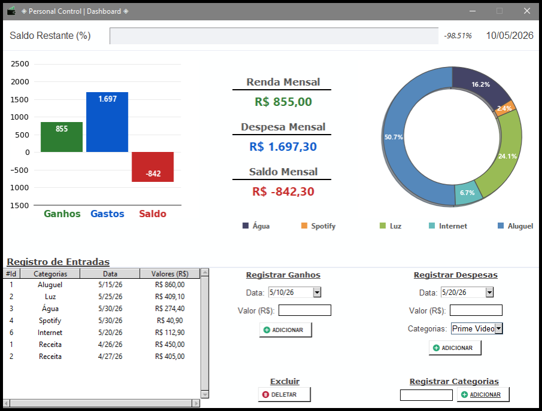
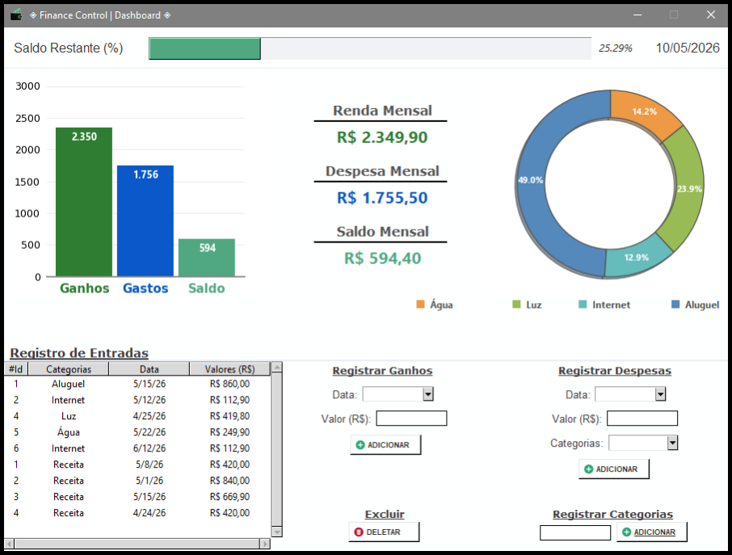
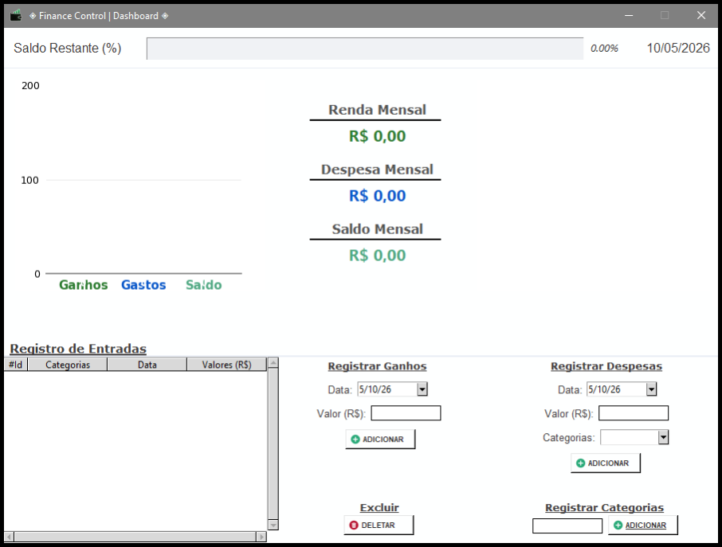

# ◈ Finance Control | Dashboard ◈

Sistema de Gestão Financeira Pessoal desenvolvido em **Python**, focado em modularização, persistência de dados e visualização de métricas em tempo real.

## 🚀 Tecnologias Utilizadas

- **Python 3.13**
- **Tkinter**: Interface gráfica (GUI).
- **SQLite3**: Banco de dados relacional para persistência local.
- **Matplotlib**: Geração de gráficos de barras e pizza.
- **Pandas**: Processamento e agrupamento de dados para os relatórios.
- **Pillow (PIL)**: Manipulação e redimensionamento de ícones e logotipos.

## 🏗️ Arquitetura do Projeto

O sistema segue princípios de **Engenharia de Software**, com separação clara de responsabilidades:

- **`Projeto02.py` (Model)**: Centraliza a conexão com o banco de dados e a criação automática das tabelas.
- **`Projeto02_View.py` (Controller)**: Contém a lógica de negócio, operações CRUD e tratamento de dados com Pandas.
- **`Projeto02(Main).py` (View)**: Ponto de entrada do sistema, gerindo a interface e a integração dos módulos.

## 📊 Funcionalidades

- **Controle de Transações**: Fluxo completo de inserção e exclusão de ganhos e gastos.
- **Gestão de Categorias**: Customização para organização detalhada das despesas.
- **Dashboard Dinâmico**: Gráficos que se atualizam automaticamente para mostrar a saúde financeira.
- **Análise Visual**: Barra de progresso para visualização imediata do saldo restante.

## 📸 Screenshots

| Dashboard Negativo | Dashboard Positivo | Dashboard Zerado |
| :---: | :---: | :---: |
|  |  |  |

## 🔒 Segurança e Boas Práticas

- **Escudo de Dados**: Utilização de `.gitignore` para impedir o upload do banco de dados local (`Dados.db`) e arquivos de cache.
- **Portabilidade**: Gestão de caminhos via biblioteca `os`, garantindo execução estável em qualquer diretório.
- **Ambiente Isolado**: Estrutura preparada para execução via Ambiente Virtual (venv).

## 🛠️ Como Executar

1. Clone o repositório:
   ```bash
   git clone [https://github.com/JuniorGritti/Finance-Control-Dashboard.git](https://github.com/JuniorGritti/Finance-Control-Dashboard.git)